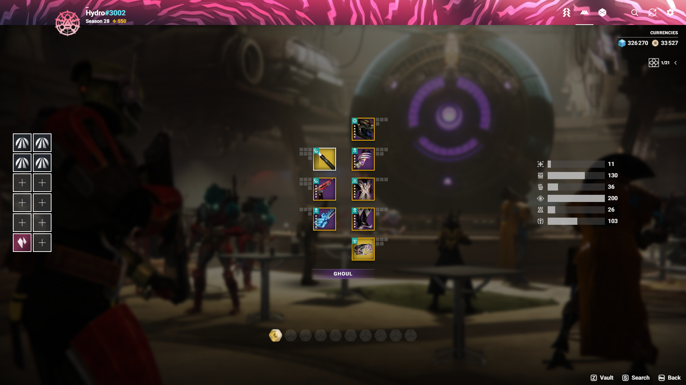

# Vanguard Item Manager

Vanguard Item Manager is a custom inventory management application for Destiny 2 players. It provides a modern, user-friendly interface to manage in-game items, equipment, and characters across all profiles and the vault. Inspired by popular tools like DIM, this app aims to streamline your Destiny inventory experience with speed, clarity, and powerful features.

---

## 🚀 Features

- **Unified Inventory View**: See all your items, equipment, engrams, currencies and postmaster across all characters and the vault in one place.
- **Advanced Search**: One query syntax, shared by the search modal and the vault, to filter items by name, perk, slot, element, tier, power or stat (see [Search syntax](#-search-syntax)).
- **Loadout Editor**: Create, view and edit loadouts, with perk, mod and subclass editors, loadout stats and save checks, then equip them in one go.
- **Item Tooltips**: Every perk column with the perks the roll can switch to, stats in the game's order (hidden stats and recoil included) with masterwork and mod bonuses, armor set bonuses, and quick links to external databases. Hover to peek, click to pin, hold Shift to compare with the equipped item.
- **Quick Actions**: Equip items on any character, move them between characters and the vault, pull them from the postmaster, and lock or unlock weapons and armor from the tooltip or the context menu.
- **Inventory Cleaner**: Send a character's unequipped weapons and armor to the vault in one click, or list the junk (worse duplicates, armor under a stat total, gear under a tier) across the vault and characters and bring it to the character to dismantle in game. Locked items and loadout items are never flagged.
- **Secure Bungie Login**: OAuth with a CSRF-protected `state`; the refresh token is kept in an `httpOnly` cookie and never exposed to client scripts.
- **Manifest Caching**: Destiny manifest files are cached in the browser between visits and refreshed only when Bungie publishes a new version.
- **Localization**: The Destiny data can be displayed in English, French, Spanish, German, Italian, Japanese, Russian, Polish or Korean.
- **Debug Mode**: Optional debug information, toggled from the settings.

---

## 📸 Screenshots



---

## 🔍 Search syntax

Every filter must match. Words outside a filter are matched against the item name.

| Filter | Example | Description |
| --- | --- | --- |
| *text* | `ace of spades` | Item name contains the text |
| `perk:` | `perk:rampage` | Active perk (or item name) contains the text |
| `is:` | `is:exotic`, `is:locked`, `is:dupe` | `weapon`, `armor`, `exotic`, `featured`, `unfeatured`, `locked`, `unlocked`, `crafted`, `masterwork`, `dupe`, or any slot / element below |
| `slot:` | `slot:heavy` | `kinetic`/`primary`, `energy`/`special`, `power`/`heavy`, `helmet`, `arms`/`gauntlets`, `chest`, `legs`, `class`/`classitem` |
| `element:` | `element:void` | `kinetic`, `arc`, `solar`, `void`, `stasis`, `strand` |
| `tier:` | `tier:5` | Gear tier |
| `power:` | `power:>=550`, `>=550` | Power level, with `>`, `>=`, `<`, `<=` or `=` |
| `stat:` | `stat:weapons>=20`, `stat:total>60` | Armor stat (current or pre-Edge of Fate names: `weapons`/`mobility`, `health`/`resilience`, `class`/`recovery`, `grenade`/`discipline`, `super`/`intellect`, `melee`/`strength`, or `total`) |

The full reference is also available in the app at `/docs/search`.

---

## 🛠️ Installation

### Prerequisites

- Node.js 22 (the version used by CI) and npm
- A Bungie application registered on the [Bungie developer portal](https://www.bungie.net/en/Application), with:
  - **OAuth Client Type**: Confidential
  - **Redirect URL**: `https://<your-host>/redirect`
  - The scopes to read the Destiny inventory and to move or equip items

### Setup

1. **Clone the repository:**
   ```bash
   git clone https://github.com/Hydroxios/VanguardItemManager.git
   cd VanguardItemManager
   ```
2. **Install dependencies:**
   ```bash
   npm install
   ```
3. **Configure the environment** in a `.env.local` file. The development and production Bungie applications are registered separately: the `_DEV` variables are used outside of production.
   ```env
   # Development
   NEXT_PUBLIC_BUNGIE_API_KEY_DEV=your-dev-api-key
   BUNGIE_CLIENT_ID_DEV=your-dev-client-id
   BUNGIE_CLIENT_SECRET_DEV=your-dev-client-secret

   # Production
   NEXT_PUBLIC_BUNGIE_API_KEY=your-api-key
   BUNGIE_CLIENT_ID=your-client-id
   BUNGIE_CLIENT_SECRET=your-client-secret
   ```
4. **Start the development server:**
   ```bash
   npm run dev
   ```

---

## 🧪 Scripts

| Command | Description |
| --- | --- |
| `npm run dev` | Start the development server (Turbopack) |
| `npm run build` | Build for production |
| `npm start` | Serve the production build |
| `npm run lint` | Run ESLint |
| `npm run typecheck` | Type-check with TypeScript |
| `npm test` | Run the unit tests with Vitest |

The CI workflow (`.github/workflows/ci.yml`) runs lint, typecheck, tests and build on every pull request and on pushes to `main` and `dev`.

---

## 📖 Usage

- Log in with your Bungie account to access your Destiny inventory.
- Use the search bar to find items quickly.
- Hover an item for its tooltip, click it to pin the tooltip (Escape or a click elsewhere closes it), and hold Shift to compare with the equipped item.
- Right-click an item to move it to another character or to the vault.
- Create, edit and equip loadouts for your characters.
- Open the settings to change the language, toggle debug mode or log out.

---

## 🧩 Tech Stack

- **Next.js 16** (App Router) & **React 19**
- **TypeScript**
- **Tailwind CSS 4**
- **Vitest**
- **Bungie API**
- **Vercel Analytics & Speed Insights**

---

## 🤝 Contributing

Contributions are welcome! To contribute:
1. Fork the repository
2. Create a new branch from `dev` (`git checkout -b feature/your-feature`)
3. Make sure `npm run lint`, `npm run typecheck` and `npm test` pass
4. Commit your changes (`git commit -m 'feat: add new feature'`)
5. Push to the branch (`git push origin feature/your-feature`)
6. Open a Pull Request

---

## 📄 License

This project is licensed under the MIT License. See [LICENSE](LICENSE) for details.

---

## 🙏 Acknowledgements

- Bungie for the Destiny API
- Inspiration from Destiny Item Manager (DIM)
