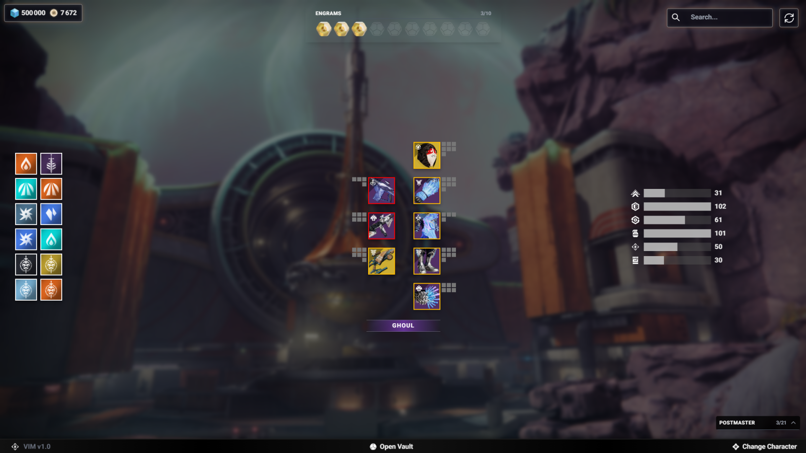

# Vanguard Item Manager

Vanguard Item Manager is a custom inventory management application for Destiny players. It provides a modern, user-friendly interface to efficiently manage in-game items, equipment, and characters across all profiles and the vault. Inspired by popular tools like DIM, this app aims to streamline your Destiny inventory experience with speed, clarity, and powerful features.

---

## 🚀 Features

- **Unified Inventory View**: See all your items, equipment, and currencies across all characters and the vault in one place.
- **Advanced Search & Filter**: Instantly search and filter items by name, type, stat, or perk.
- **Loadout Management**: Create, edit, and equip custom loadouts for any activity or playstyle.
- **Weapon Stats Visualization**: View detailed weapon stats with progress bars and breakdowns.
- **Quick Actions**: Move, equip, or vault items with a single click.
- **Refresh Inventory**: Instantly sync your inventory with the latest in-game data.
- **Responsive UI**: Optimized for desktop and mobile devices.

---

## 📸 Screenshots

> _Add screenshots of your app here_

- 

---

## 🛠️ Installation

1. **Clone the repository:**
   ```bash
   git clone https://github.com/Hydroxios/VanguardItemManager.git
   cd vanguard-item-manager
   ```
2. **Install dependencies:**
   ```bash
   npm install
   ```
3. **Start the development server:**
   ```bash
   npm run dev
   ```

---

## 📖 Usage

- Log in with your Bungie account to access your Destiny inventory.
- Use the search bar to find items quickly.
- Click on items for detailed tooltips and stats.
- Create and manage loadouts for your characters.
- Use the refresh button to sync your inventory.

---

## 🧩 Tech Stack

- **Next.js** (React framework)
- **TypeScript**
- **Tailwind CSS**
- **Bungie API**

---

## 🤝 Contributing

Contributions are welcome! To contribute:
1. Fork the repository
2. Create a new branch (`git checkout -b feature/your-feature`)
3. Commit your changes (`git commit -m 'Add new feature'`)
4. Push to the branch (`git push origin feature/your-feature`)
5. Open a Pull Request

---

## 📄 License

This project is licensed under the MIT License. See [LICENSE](LICENSE) for details.

---

## 🙏 Acknowledgements

- Bungie for the Destiny API
- Inspiration from Destiny Item Manager (DIM)